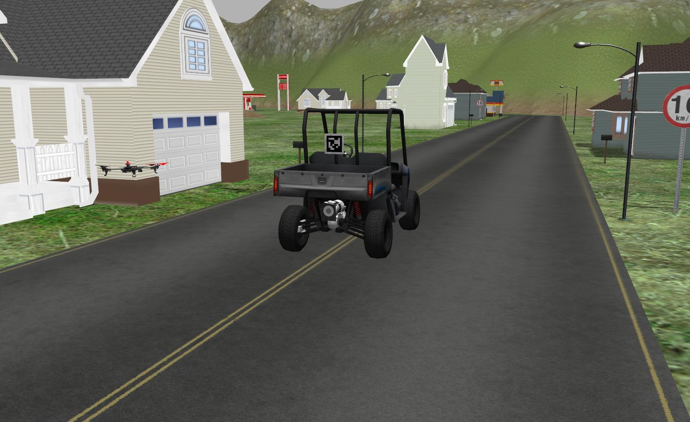
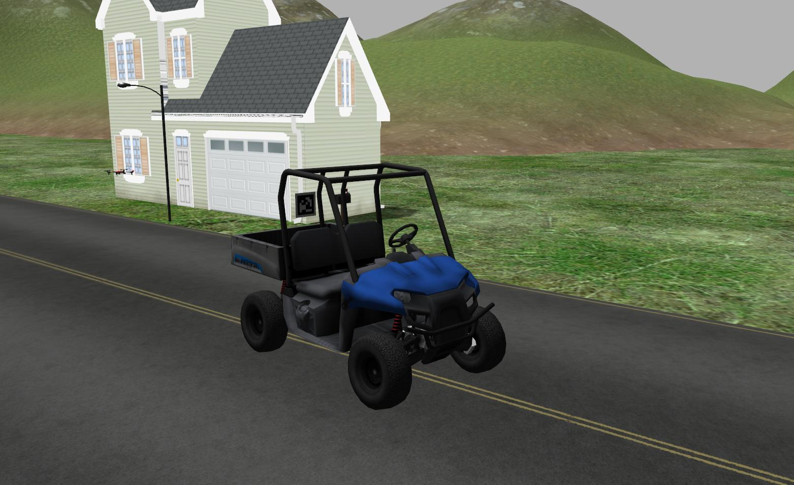

# CLDrone:Autonomous Quadrotor Simulation Research Platform

This is a project based on Pixhawk SITL, DRCSim and apriltag. The goal is to create a convenient simulation platform to test intelligent algorithms on quadrotors.

